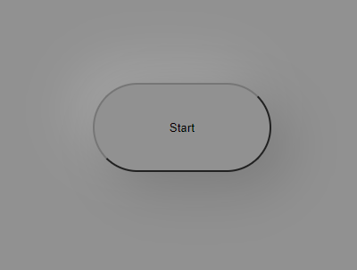

# Brick Breaker Game coded with Javascript
## All the logics and components in this game are built are built using js on canvas
---
### ScreenShots:
 
 
 

### How to play:
1. Just go to the link
2. You can use bot arrow keys `< >` as well as mouse cursor to move your controller
3. What you need to do is to make sure the ball does not touches the ground
4. The more bricks you break the more score you will achieve 
5. You need to distroy all the bricks to win this game
6. If you fail to do so, then click on `start` button after clicking `ok` on the alert it will restart the game.

### Features:
1. Get random color bricks everytime you replay
2. All the conditions written run smooth with no bugs
3. Controller moves a little fast to increase the difficulty leveel of the game
4. You may take screen shots of your score and compete with your friends.
5. The start button has Neumorphism. Overall everything is simple and beautiful.

### How to clone:
1. You may fork this project by clicking `fork` button from the top right corner then it will create the same repository on your github profile
2. It is a two step process
    1. Click on the `Code with down arrow` button in right corner below setting tab.
    2. Then click on download as a zip file to store it to your local store. Extract them and do any changes you like.